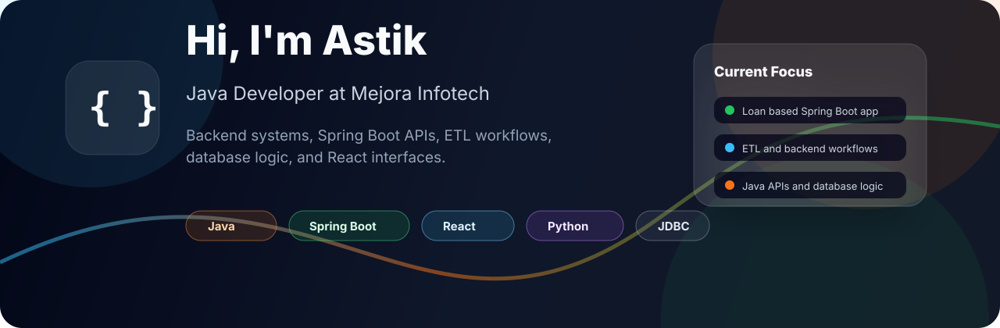

<p align="center">
  
</p>

<h1 align="center">Hi, I'm Astik</h1>

<p align="center">
  <b>Java Developer at Mejora Infotech</b><br />
  I build backend systems, Spring Boot APIs, ETL workflows, database-driven features, and clean React interfaces.
</p>

<p align="center">
  
  
  
</p>

---

## About Me

```java
public class Astik {
    String role = "Java Developer";
    String company = "Mejora Infotech";
    String currentFocus = "Loan based Java Spring Boot application";
    String[] interests = {"Backend Development", "ETL", "APIs", "Databases", "React UI"};
}
```

- Working as a **Java Developer** at **Mejora Infotech**
- Currently building a **loan based Java Spring Boot application**
- Experienced with **ETL workflows**, backend services, JDBC, and REST APIs
- Comfortable working across **Java, Python, React, Spring Boot, and database logic**
- Focused on writing clean, practical, and maintainable application code

## Tech Stack

<p align="center">
  
</p>

| Category | Skills |
| --- | --- |
| Backend | Java, Spring Boot, REST APIs, JDBC |
| Frontend | React, JavaScript, HTML, CSS |
| Database | SQL, JDBC, database-driven application logic |
| Programming | Java, Python |
| Tools | Git, GitHub, VS Code, Eclipse |
| Current Work | ETL workflows, loan based Spring Boot application |

## Featured Work

<table>
  <tr>
    <td width="50%">
      <h3>Loan Based Spring Boot Application</h3>
      <p>
        Working on a Java Spring Boot application focused on loan-related workflows,
        backend APIs, data processing, and database integration.
      </p>
      <p><b>Tech:</b> Java, Spring Boot, JDBC, SQL</p>
    </td>
    <td width="50%">
      <h3>ETL Workflows</h3>
      <p>
        Building and supporting extract, transform, and load processes for moving
        and preparing data across systems.
      </p>
      <p><b>Tech:</b> Java, Python, SQL, backend automation</p>
    </td>
  </tr>
  <tr>
    <td width="50%">
      <h3>HR Assistant</h3>
      <p>
        Full-stack HR assistant project with FastAPI backend, React frontend,
        employee login, leave management, and AI-assisted HR workflows.
      </p>
      <p>
        <a href="https://github.com/astik2002/hr-assistant">View Repository</a>
      </p>
    </td>
    <td width="50%">
      <h3>Frontend Practice Projects</h3>
      <p>
        Built UI-focused projects such as landing pages and calculators to improve
        frontend fundamentals and responsive design skills.
      </p>
      <p><b>Tech:</b> HTML, CSS, JavaScript, React</p>
    </td>
  </tr>
</table>

## GitHub Stats

<p align="center">
  
  
</p>

<p align="center">
  
</p>

## Current Focus

```text
Learning deeper Spring Boot patterns
Improving backend architecture and API design
Practicing database and JDBC based application logic
Building full-stack projects with Java, Python, and React
```

## Connect

<p align="center">
  <a href="https://github.com/astik2002">
    
  </a>
</p>

---

<p align="center">
  <i>Thanks for visiting my profile. I am always learning, building, and improving one project at a time.</i>
</p>
